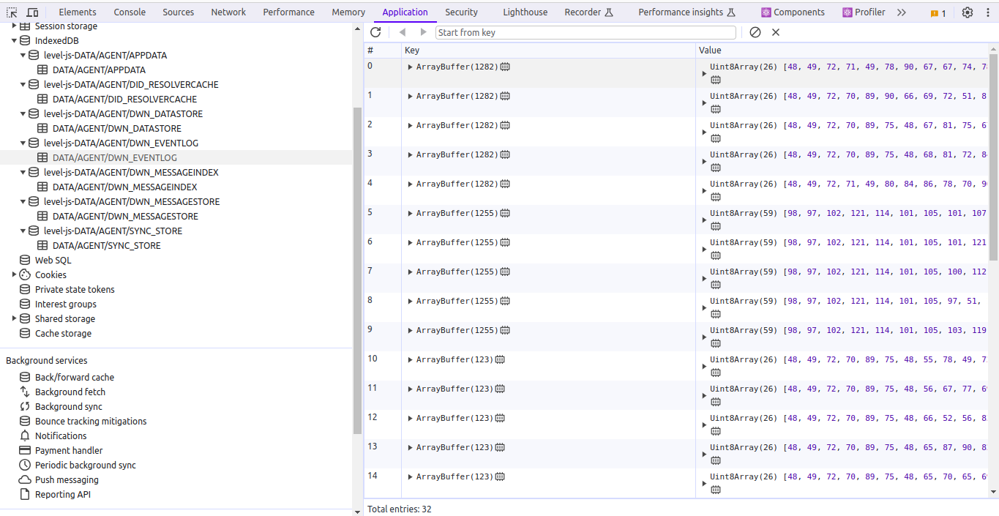
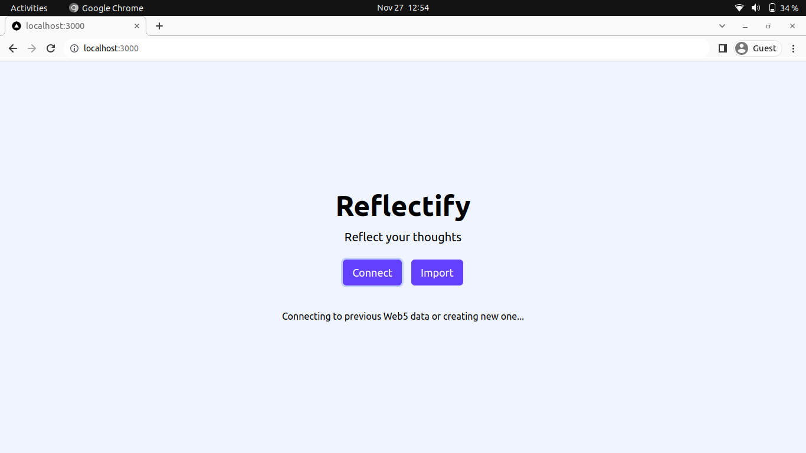
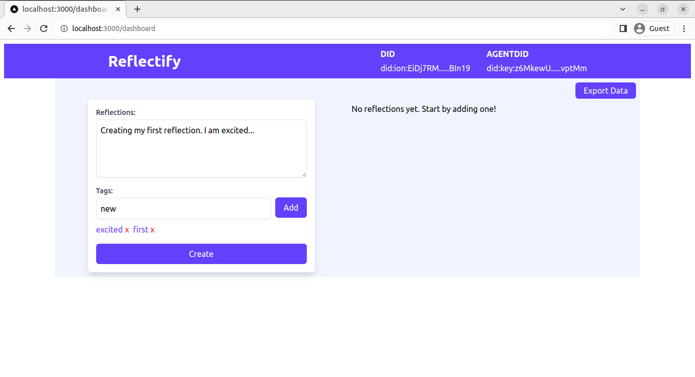
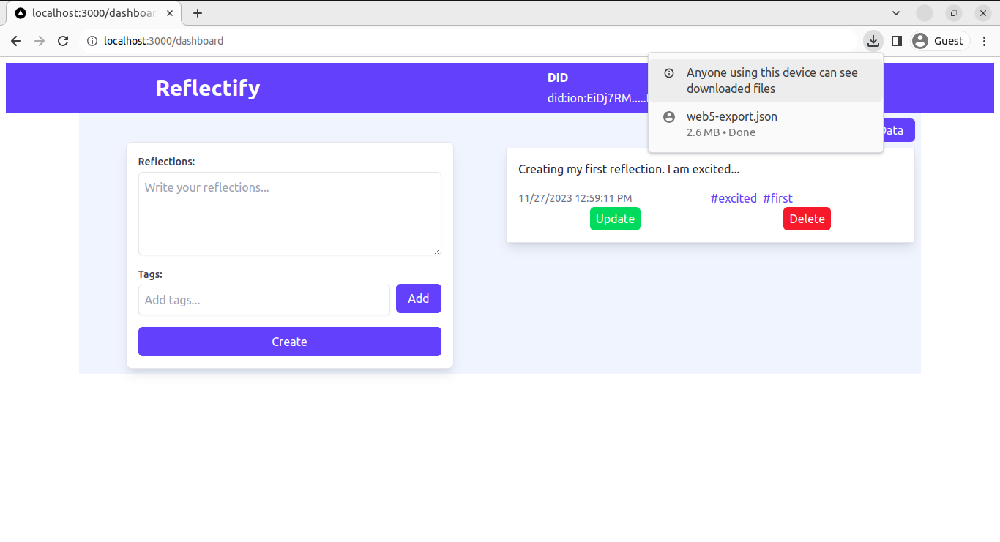
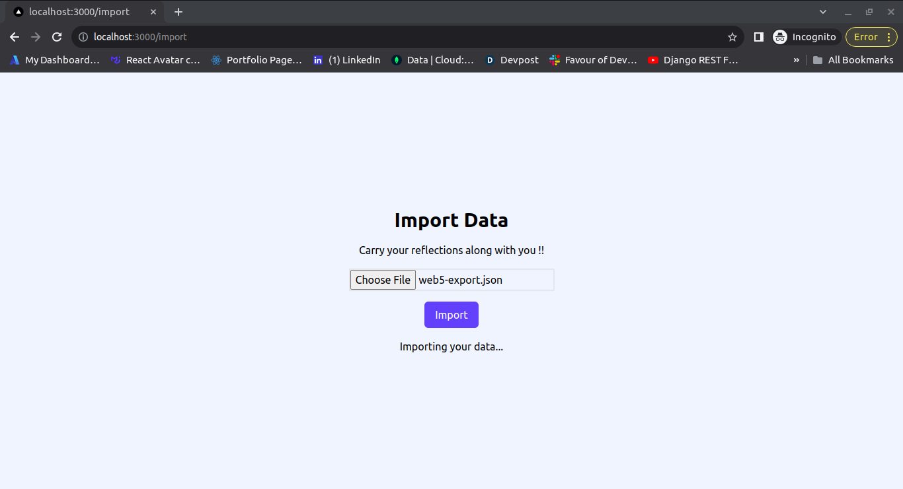
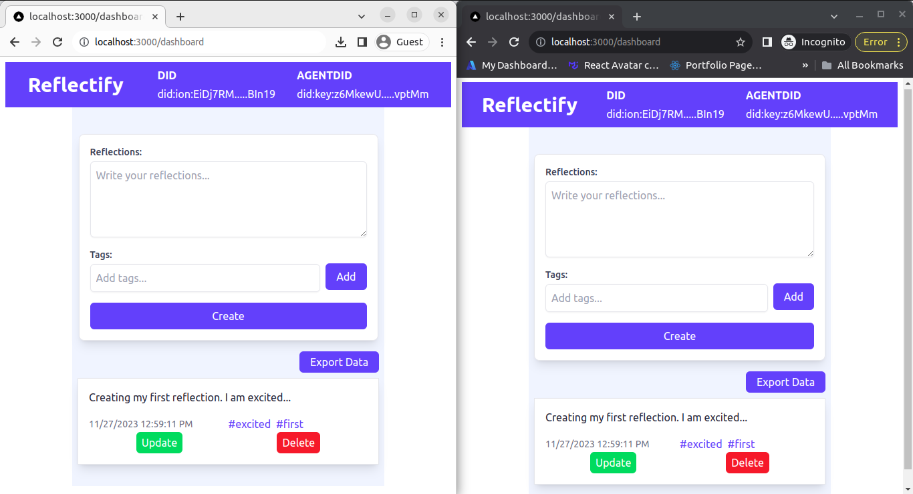

# Guide to Exporting and Importing Data within Web5 Applications

## Introduction

The evolution of Web5 brings forth a revolutionary shift in our online experiences, ushering in a decentralized ecosystem empowered by blockchain technology. This transformative wave grants users unprecedented control over their data and digital interactions.

However, along with this newfound autonomy, arises the challenge of seamlessly managing and exchanging data across Web5 applications.

## What is IndexedDB?

IndexedDB, a robust JavaScript API for offline data storage and retrieval, plays a pivotal role in addressing this challenge. In the context of Web5, IndexedDB becomes a crucial component, enabling efficient data export and import. This ensures that users maintain ownership and control over their information as they navigate the decentralized web.

## Web5 applications and IndexedDB

```javascript
import { Web5 } from '@web5/api';

const { web5, did } = await Web5.connect();
```

When initializing a connection to Web5 in your web application using web5.js like above, your browser's IndexedDB is automatically populated with several databases and stores. These databases include:

1. level-js-DATA/AGENT/APPDATA
2. level-js-DATA/AGENT/DID_RESOLVERCACHE
3. level-js-DATA/AGENT/DWN_DATASTORE
4. level-js-DATA/AGENT/DWN_EVENTLOG
5. level-js-DATA/AGENT/DWN_MESSAGEINDEX
6. level-js-DATA/AGENT/DWN_MESSAGESTORE
7. level-js-DATA/AGENT/SYNC_STORE

Each database has a store with the same name, excluding the `level-js-` prefix. These stores contain key-value pairs, where the key is a unique identifier in the `ArrayBuffer` type, and the value is the data itself in the `Uint8Array` type.



## Exporting Data

### Converting Database to JavaScript Object

Let's break down the export process.

The `exportFromIndexedDB` function fetches all IndexedDB databases, extracts data from each object store, and organizes it into a structured JavaScript object.

```javascript
const exportFromIndexedDB = async () => {
  const allDatabases = [];

  try {
    let databases;

    try {
      // Try to use indexedDB.databases() if available
      databases = await indexedDB.databases();
    } catch (databasesError) {
      console.warn(
        'indexedDB.databases() is not available. Using manual list of databases.',
      );

      // If indexedDB.databases() is not available e.g in Firefox, use a manual list of databases
      databases = [
        { name: 'level-js-DATA/AGENT/APPDATA' },
        { name: 'level-js-DATA/AGENT/DID_RESOLVERCACHE' },
        { name: 'level-js-DATA/AGENT/DWN_DATASTORE' },
        { name: 'level-js-DATA/AGENT/DWN_EVENTLOG' },
        { name: 'level-js-DATA/AGENT/DWN_MESSAGEINDEX' },
        { name: 'level-js-DATA/AGENT/DWN_MESSAGESTORE' },
        { name: 'level-js-DATA/AGENT/SYNC_STORE' },
      ];
    }

    if (databases.length === 0) {
      console.log('No IndexedDB databases found.');
      return [];
    }

    for (const databaseInfo of databases) {
      const { name: databaseName } = databaseInfo;

      // Open a connection to the IndexedDB database
      const db = await new Promise((resolve, reject) => {
        const request = indexedDB.open(databaseName);

        request.onerror = (event) => reject(event.target.error);

        request.onsuccess = (event) => resolve(event.target.result);
      });

      // Object to store information about the current database
      const databaseObject = {
        name: databaseName,
        stores: [],
      };

      // Fetch names of all object stores in the current database
      const objectStoreNames = Array.from(db.objectStoreNames);

      for (const objectStoreName of objectStoreNames) {
        // Object to store information about the current object store
        const storeData = {
          name: objectStoreName,
          data: [],
        };

        // Create a read-only transaction for the current object store
        const transaction = db.transaction(objectStoreName, 'readonly');

        // Get a reference to the current object store
        const objectStore = transaction.objectStore(objectStoreName);

        // Open a cursor to iterate through key-value pairs in the object store
        const cursor = objectStore.openCursor();

        // Promise to handle the cursor's success and error events
        await new Promise((resolve, reject) => {
          cursor.onsuccess = (event) => {
            const cursor = event.target.result;

            if (cursor) {
              // Convert the ArrayBuffer and Uint8Array to arrays for easier JSON serialization
              const keyArray = Array.from(new Uint8Array(cursor.key));
              const valueArray = Array.from(cursor.value);

              storeData.data.push({ key: keyArray, value: valueArray });

              cursor.continue();
            } else {
              resolve();
            }
          };

          cursor.onerror = (event) => reject(event.target.error);
        });

        databaseObject.stores.push(storeData);
      }

      allDatabases.push(databaseObject);

      db.close();
    }

    return allDatabases;
  } catch (error) {
    console.error('Error exporting IndexedDB to raw array JSON:', error);
  }
};
```

### Exporting Data to a File

To make the export tangible, the `exportToJSONFile` function takes the structured data and saves it as a downloadable JSON file.

```javascript
const exportToJSONFile = async () => {
  try {
    // Retrieve data from IndexedDB using the exportFromIndexedDB function
    const data = await exportFromIndexedDB();

    // Create a Blob containing the JSON data
    const blob = new Blob([JSON.stringify(data, null, 2)], {
      type: 'application/json',
    });

    const url = URL.createObjectURL(blob);

    const link = document.createElement('a');
    link.href = url;
    link.download = 'web5-export.json';
    link.click();

    URL.revokeObjectURL(url);
    document.body.removeChild(link);
  } catch (error) {
    console.error('Error exporting raw array JSON to file:', error);
  }
};
```

### Exported Data Structure

The exported data should look like this:

```js
[
  {
    name: 'level-js-DATA/AGENT/APPDATA',
    stores: [
      {
        name: 'DATA/AGENT/APPDATA',
        data: [
          {
            key: [
              /* integer values for the ArrayBuffer */
            ],
            value: [
              /* integer values for the Uint8Array */
            ],
          },
          // ... more key-value pairs ...
        ],
      },
    ],
  },
  // ... more databases ...
];
```

## Importing Data

Importing the data is just the reverse of the export process. The exported data is converted to a JavaScript object and then imported to IndexedDB.

### Reading from a File and Converting to JavaScript Object

The import process begins by reading a JSON file and converting it into a structured JavaScript object. The `importFromJSONFile` function takes care of this.

```javascript
const importFromJSONFile = async (file) => {
  // Return a Promise for asynchronous file reading and JSON parsing
  return new Promise((resolve, reject) => {
    const fileReader = new FileReader();

    fileReader.onload = (event) => resolve(JSON.parse(event.target.result));
    fileReader.onerror = (error) => reject(error);
    fileReader.readAsText(file);
  });
};
```

### Importing Data to Database

With the structured object in hand, the `importToIndexedDB` function recreates the databases and object stores in IndexedDB.

```javascript
const importToIndexedDB = async (file) => {
  try {
    // Obtain structured data from the JSON file using importFromJSONFile function
    const importData = await importFromJSONFile(file);

    for (const database of importData) {
      const { name: databaseName, stores } = database;

      // Open the IndexedDB with the specified name and version (1)
      const openRequest = indexedDB.open(databaseName, 1);

      openRequest.onerror = (event) => {
        console.error('Error opening database:', event.target.error);
      };

      await new Promise((resolve, reject) => {
        openRequest.onsuccess = (event) => {
          const db = event.target.result;

          // Close the current connection to allow the upgrade to complete
          db.close();

          resolve();
        };

        openRequest.onupgradeneeded = (event) => {
          const db = event.target.result;

          // Create object stores based on the importData if they don't exist
          for (const store of stores) {
            if (!db.objectStoreNames.contains(store.name)) {
              db.createObjectStore(store.name);
            }
          }
        };

        openRequest.onblocked = (event) => {
          console.error('Database upgrade blocked:', event.target.error);
          reject(event.target.error);
        };
      });

      // Open a new connection after the upgrade is complete
      const db = await new Promise((resolve, reject) => {
        const request = indexedDB.open(databaseName, 1);

        request.onerror = (event) => reject(event.target.error);

        request.onsuccess = (event) => resolve(event.target.result);
      });

      // Iterate over each store in the database and add data to the respective object stores
      for (const store of stores) {
        const { name: storeName, data } = store;

        // Begin a read-write transaction for the object store
        const transaction = db.transaction(storeName, 'readwrite');
        const objectStore = transaction.objectStore(storeName);

        // Clear existing data in the object store to avoid duplicates
        objectStore.clear();

        // Add each item of data to the object store
        for (const item of data) {
          const keyArrayBuffer = new Uint8Array(item.key).buffer;
          const valueUint8Array = new Uint8Array(item.value);

          objectStore.add(valueUint8Array, keyArrayBuffer);
        }
      }

      db.close();
    }

    console.log('Import successful!');
  } catch (error) {
    console.error('Error importing raw array JSON to IndexedDB:', error);
  }
};
```

## Example Application: Exporting and Importing Data

To further illustrate the concepts discussed in this guide, let's walk through an example web application built with NextJS that demonstrates the export and import functionalities using IndexedDB in a Web5 environment.

The application name is `Reflectify` - a simple Web5 diary application that allows users to write their thoughts and reflections. It enables them transport their thoughts across devices by exporting and importing their data.

### Steps to Run the Example Application

1. Clone the Repository:

```bash
git clone https://github.com/koredeycode/web5-diary.git
```

2. Install Dependencies:

```bash
cd web5-diary
npm install
```

3. Run the Application:

```bash
npm run dev
```

4. Open the Application in Your Browser:

Visit `http://localhost:3000` in your browser.

5. Connect to Web5:

Click the "Connect" button to establish a connection to Web5. This action creates a new Web5 account and saves the data to your browser's IndexedDB.



Note: If you have previously connected to Web5 this way, new data won't be created. Instead, the existing data will be retrieved from IndexedDB.

6. Create a Record:

After connecting to Web5, you will be redirected to the dashboard at `https://localhost:3000/dashboard`. You will see the newly created Decentralized Identifier (DID) and agent DID.

Create a simple Web5 record by adding a new reflection within the application using the form.



7. Export Data:

Click the "Export Data" button to export the data to a JSON file (`web5-export.json`).



8. Importing the data

Open a new incognito window and navigate to `http://localhost:3000`.

Click the "Import" button, which will redirect you to `http://localhost:3000/import`.

Upload the JSON file (`web5-export.json`) that you exported earlier.

Click the "Import" button to import the data into your browser's IndexedDB.



12. Compare Data in Two Windows:

Compare the data between the two browser windows. The Decentralized Identifier (DID) and the agent DID should be the same.

The Web5 records should also match.



Feel free to explore the source code of the example application to gain insights into how the export and import functionalities are implemented. This practical example provides a hands-on experience with IndexedDB in a Web5 context.

## Conclusion

In summary, this guide has provided a comprehensive overview of exporting and importing data within Web5 applications using IndexedDB. We explored the essential steps, from converting data to JavaScript objects to the export-to-file process and the recreation of databases during import.

The Reflectify example application showcased the practical implementation of these concepts, enabling users to effortlessly transport their reflections across devices. By incorporating these export and import functionalities, developers can empower users with greater control over their data in a decentralized web environment, contributing to enhanced user experiences and the success of Web5 projects.

Happy coding!
